# Pellicule

**Le carnet de prise de vue argentique, gratuit, pour iPhone.**

Vous venez de charger votre première pellicule, ou votre centième. À chaque
déclenchement, il faudrait noter la vitesse, l'ouverture, le sujet, la lumière —
sinon, trois semaines plus tard, le rouleau revient du laboratoire et vous ne
savez plus pourquoi la vue 14 est sombre ni où était prise la 22. Un carnet
papier le fait ; il ne sait pas vous dire que votre boîtier ne monte pas au
1/2000, ni mesurer la lumière, ni inscrire tout cela dans vos scans.

Pellicule fait tout ça. **Sans compte, sans abonnement, sans publicité, sans
serveur** : vos données restent dans votre téléphone, et le code est libre.

<p align="center">
  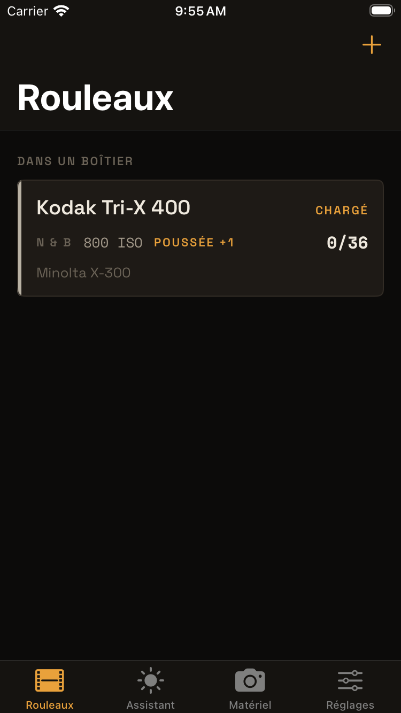
  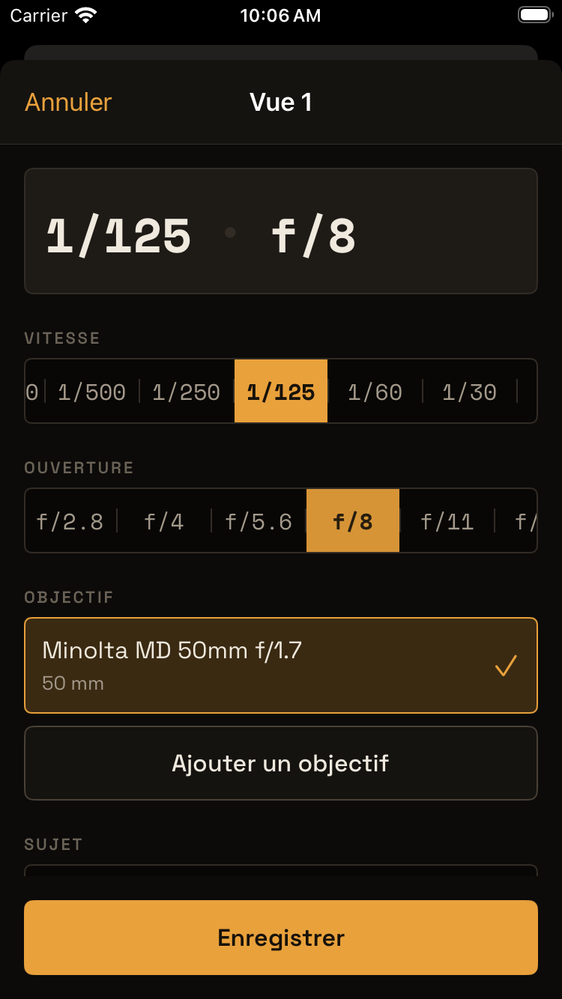
  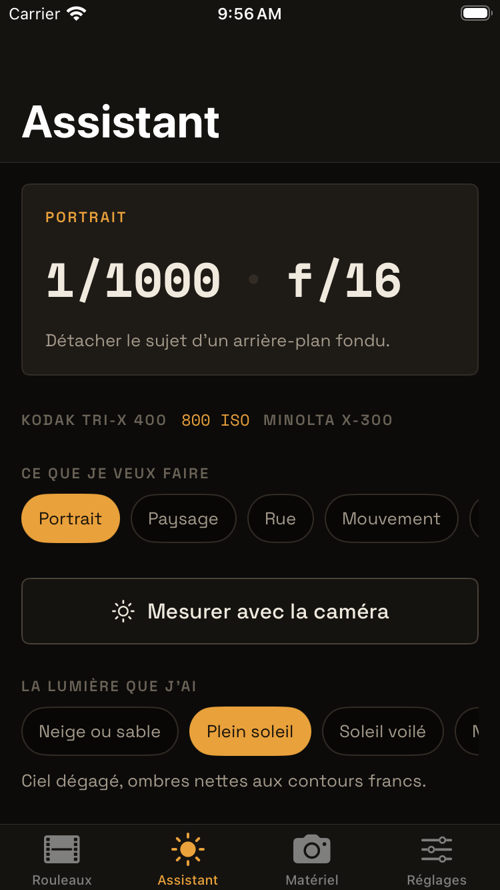
  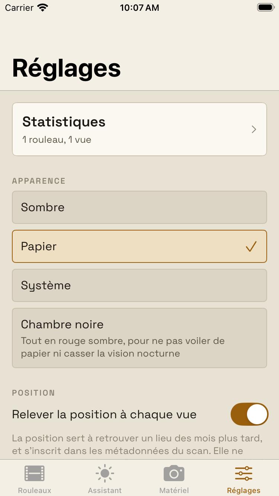
</p>

## Pourquoi celle-là

La plupart des carnets argentiques sur iPhone sont payants ou par abonnement,
et gardent vos données chez eux. Pellicule est **gratuite et le restera** : elle
n'a pas de serveur à financer, pas de compte à vous faire créer, rien à vous
vendre. Elle est écrite pour quelqu'un qui débute — chaque conseil dit
*pourquoi* — et pour quelqu'un qui pratique depuis vingt ans — rien n'est
imposé, tout se corrige.

Et elle est **honnête** : quand elle ne sait pas, elle le dit. Une valeur
absente y vaut mieux qu'une valeur devinée.

## Ce qu'elle fait

**Elle connaît votre matériel.** Plus de cent cinquante boîtiers et
soixante-dix objectifs dans la banque, avec leurs vraies plages de vitesses et
d'ouvertures. Choisissez votre Minolta X-300 : l'application ne vous proposera
plus jamais un 1/2000 qu'il ne sait pas faire. Un appareil absent se déclare à
la main en trente secondes.

<p align="center">
  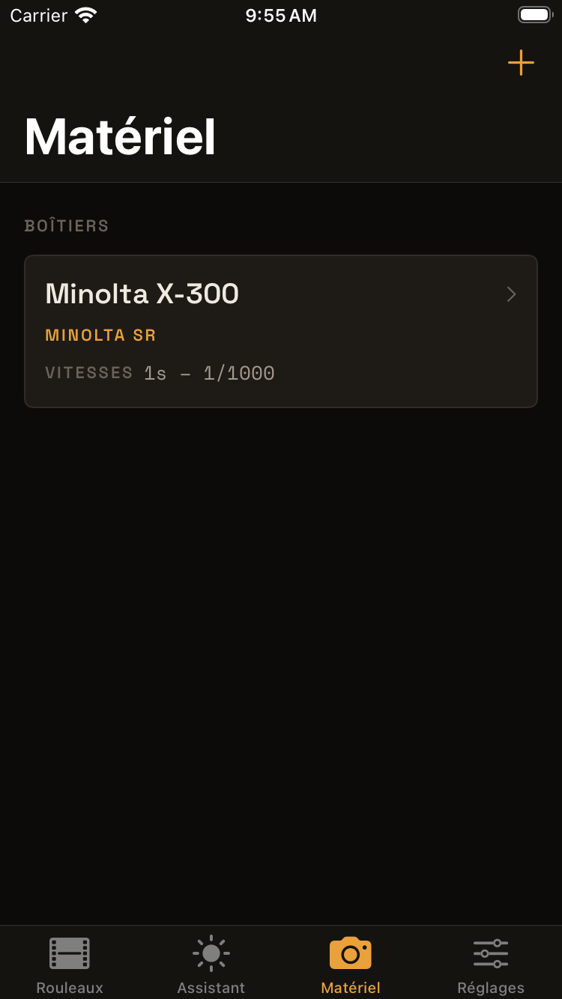
  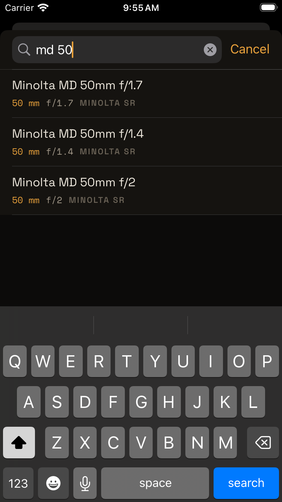
  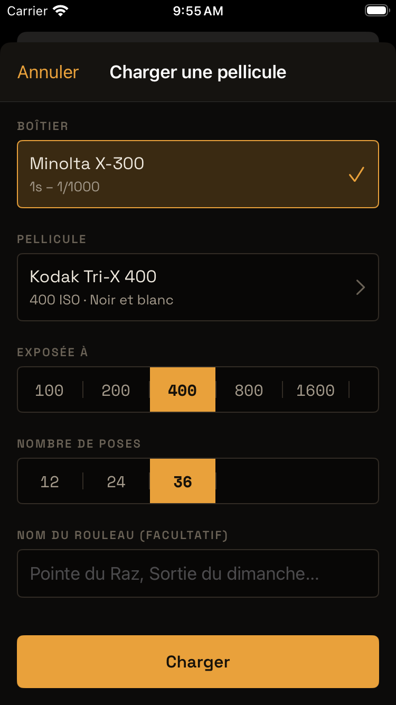
</p>

**Elle tient le rouleau.** Chargez une pellicule — une cinquantaine
d'émulsions préchargées, noir et blanc, couleur, diapositive —, dites si vous
la poussez, puis notez chaque vue : vitesse, ouverture, objectif, filtre et son
coût en lumière, position, photo de repérage prise au téléphone pour
reconnaître le cadrage plus tard. Les réglages se reprennent d'une vue à
l'autre : sur le terrain, c'est deux gestes.

<p align="center">
  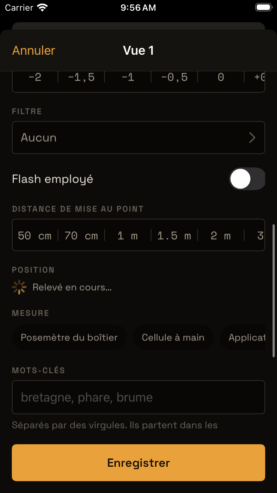
  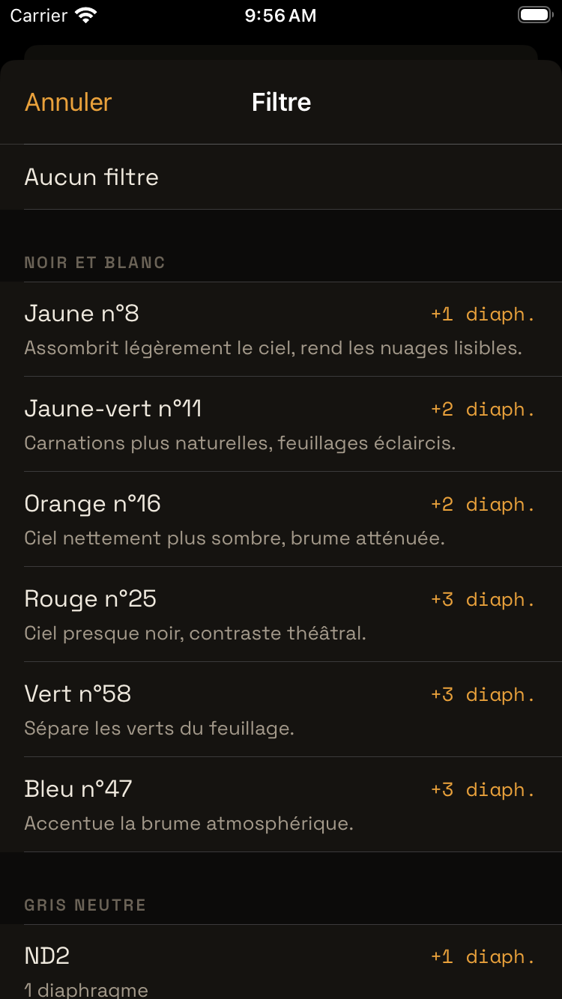
  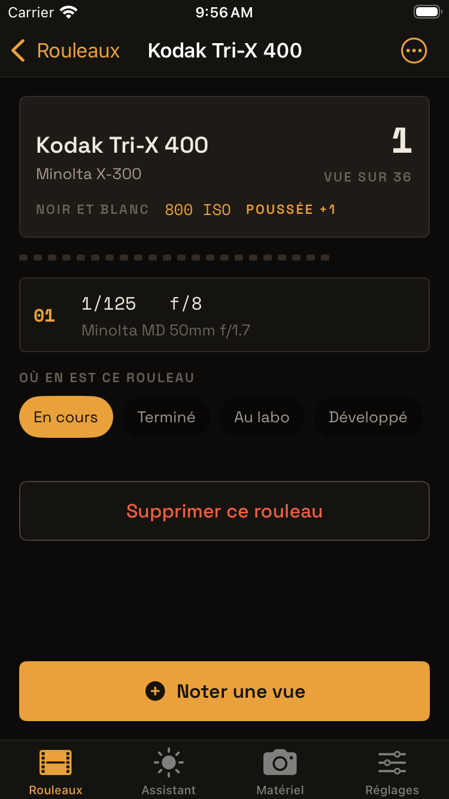
</p>

**Elle vous aide à régler.** Dites ce que vous voulez faire — un portrait, un
paysage, une rue, un filé — et la lumière que vous avez devant vous. L'assistant
en déduit le couple vitesse/ouverture, la zone de netteté, l'hyperfocale, et
explique ce qui coince quand la scène sort des limites de votre matériel : film
trop rapide, filtre gris neutre nécessaire, risque de flou de bougé. Il ne
propose jamais un réglage que votre boîtier ne sait pas tenir.

**Elle mesure la lumière.** La caméra du téléphone sert de posemètre. Elle
compare sa mesure à votre estimation à l'œil — c'est comme ça qu'on apprend à
s'en passer — et vous prévient quand elle est au bout de ce qu'elle sait
mesurer, au lieu d'afficher un chiffre qui aurait l'air d'en être un.

<p align="center">
  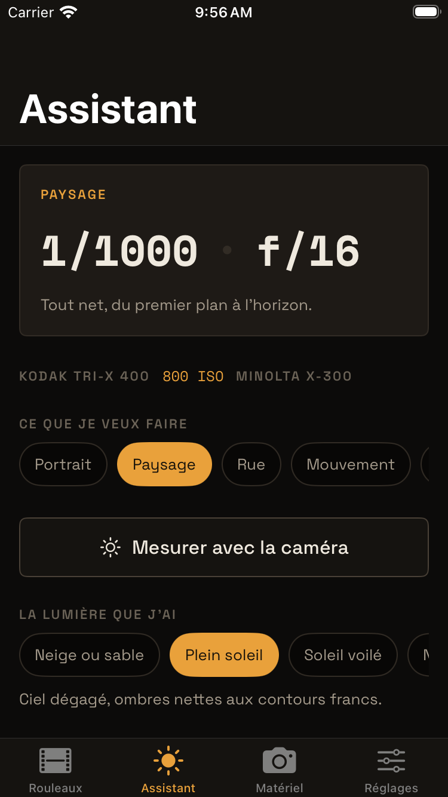
  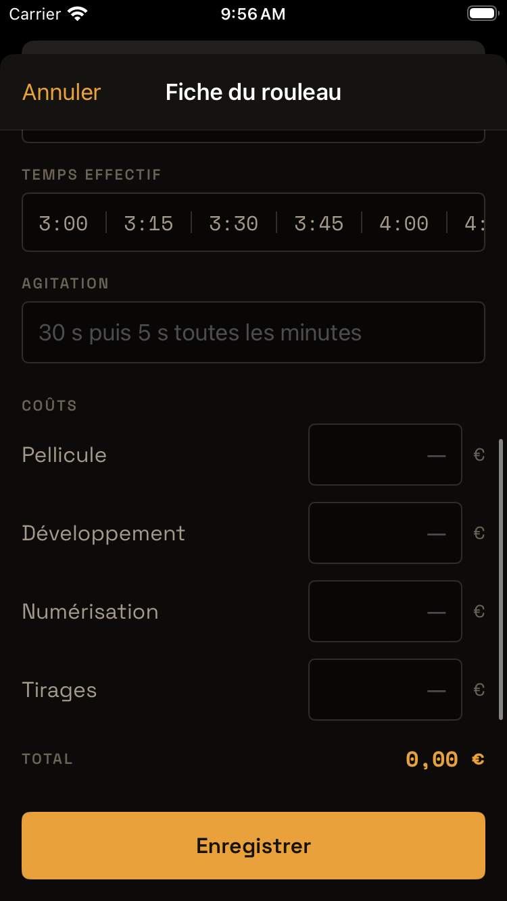
  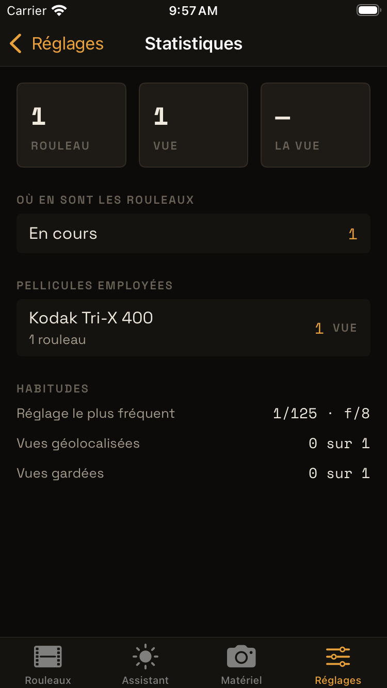
</p>

**Elle suit le rouleau jusqu'à l'archive.** Terminé, au labo, développé,
scanné, archivé ; référence de la pochette, laboratoire, coûts. Si vous
développez vous-même : révélateur, dilution, température, et le temps suggéré
d'après les données du film et la poussée du rouleau.

**Elle rend aux scans ce que le laboratoire leur a retiré.** Un scan arrive nu,
daté du jour de la numérisation. Pellicule y inscrit la date de prise de vue,
le boîtier, l'objectif, les réglages, le lieu — dans des copies, jamais dans
vos originaux. Vos photos argentiques se comportent alors comme des photos
numériques dans n'importe quelle photothèque.

<p align="center">
  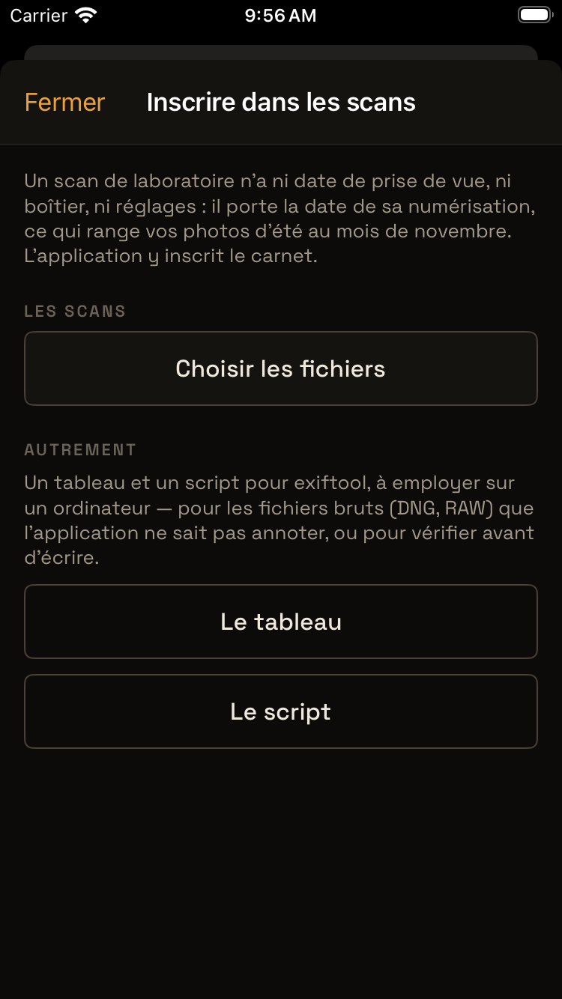
  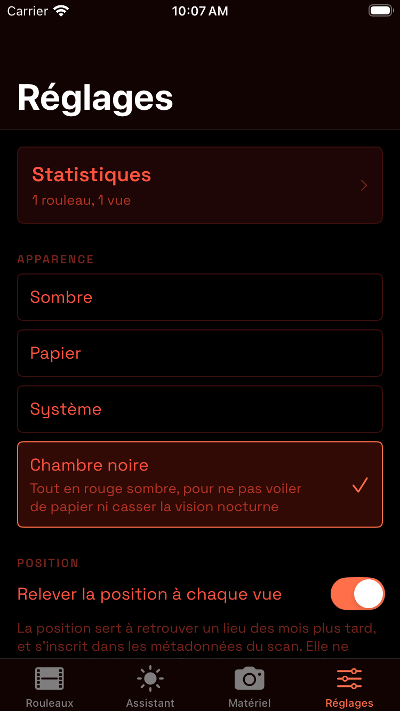
</p>

**Et le reste.** Statistiques — coût par vue, émulsion préférée, réglage le
plus fréquent. Trois thèmes, dont une chambre noire entièrement rouge pour ne
pas voiler de papier. Sauvegarde en un fichier lisible qui vous appartient,
récupérable dans Fichiers même si l'application refusait de s'ouvrir.

## Installer

> **À lire avant, c'est important.** Pellicule n'est pas sur l'App Store — y
> être coûte 99 € par an, et le projet préfère rester gratuit. Elle s'installe
> en la signant avec **votre propre compte Apple**, et cette signature
> **expire au bout de sept jours** : c'est une règle d'Apple, aucun outil ne
> la contourne. Avec AltStore, la re-signature se fait toute seule par le
> Wi-Fi tant que votre ordinateur est allumé ; sans, il faut réinstaller
> chaque semaine. Dans tous les cas **le carnet n'est jamais perdu**, et
> l'application affiche elle-même la date d'expiration dans *Réglages → À
> propos*. Un compte gratuit signe trois applications au maximum.

En vingt minutes, une fois :

1. **Installez AltServer** sur votre Mac ou PC depuis <https://altstore.io>, et
   branchez l'iPhone au câble. Sur macOS, dans le Finder, cochez « Afficher cet
   iPhone lorsqu'il est en Wi-Fi ».
2. Dans le menu AltServer, **Install AltStore** sur votre iPhone, avec votre
   identifiant Apple. Sur l'iPhone, faites confiance au profil dans
   *Réglages → Général → VPN et gestion de l'appareil*.
3. Sur l'iPhone, téléchargez **`Pellicule.ipa`** depuis la
   [dernière version](https://github.com/thibautbaxome/Pellicule/releases/latest).
4. Dans AltStore, onglet *My Apps* : **+**, choisissez le fichier. L'icône
   apparaît.

Ensuite, rien : AltStore re-signe Pellicule en tâche de fond. Pour mettre à
jour, même geste avec le nouvel `.ipa` — le carnet est conservé.

Les autres méthodes (iLoader, Sideloadly, SideStore), les pannes courantes et
ce qu'il faut savoir sur votre identifiant Apple sont dans
[INSTALLATION.md](INSTALLATION.md).

## Sous le capot

`PelliculeCore/` contient tout ce qui calcule et tout ce qui se range : échelles
d'exposition, réciprocité, profondeur de champ, temps de développement, moteur
de l'assistant, banques de matériel, carnet, sauvegarde, métadonnées. Il ne
dépend d'**aucune bibliothèque Apple** et se teste sur Linux comme sur macOS,
en une dizaine de secondes — cent cinquante tests, dont un balayage de
1 700 combinaisons de l'assistant.

```sh
cd PelliculeCore && swift test
```

`App/` ne contient que des écrans SwiftUI. À chaque poussée, l'intégration
continue rejoue les tests sur Linux, compile l'application pour iPhone, la fait
tourner dans un simulateur où un parcours automatisé traverse tous les écrans,
et publie une capture de chacun sur la branche `captures`.

**Réserves.** Les exposants de réciprocité viennent des notices des fabricants
quand elles les publient, de l'interpolation de leurs tables sinon. La
correction de température du développement suit un coefficient de 2,5 pour
10 °C, et la poussée allonge d'environ 35 % par diaphragme. Ces modèles
reproduisent les tables publiées à quelques pourcents près : ils cadrent une
décision sur le terrain, ils ne remplacent ni la notice du film ni, après
quelques rouleaux, votre propre expérience.

**Ce qu'elle ne fera pas.** Un compte, un serveur, de la télémétrie. Il n'y a
rien à héberger et rien à collecter. Format 135 seulement pour l'instant ; pas
de version Android ni ordinateur.

## Contribuer

Voir [CONTRIBUTING.md](CONTRIBUTING.md). La contribution la plus utile n'exige
aucune connaissance de Swift : compléter les banques de boîtiers, d'objectifs et
de pellicules, qui sont de simples fichiers JSON. Si votre appareil manque, vous
êtes la bonne personne pour l'ajouter.

## Licence

[MIT](LICENSE).
